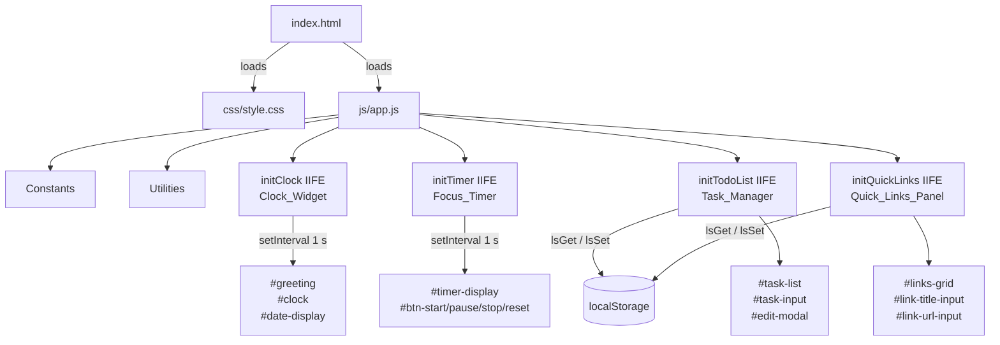
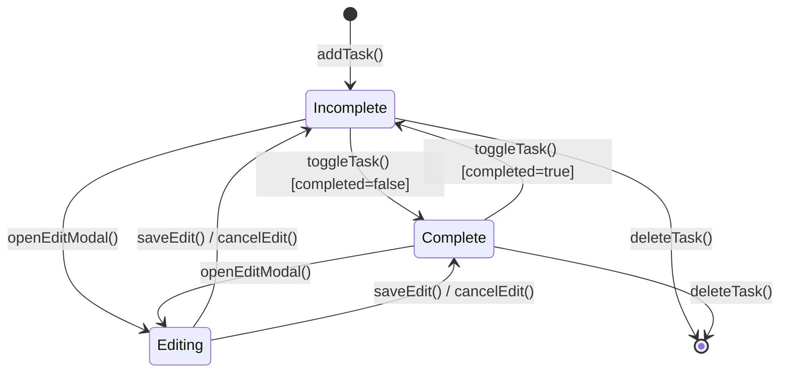
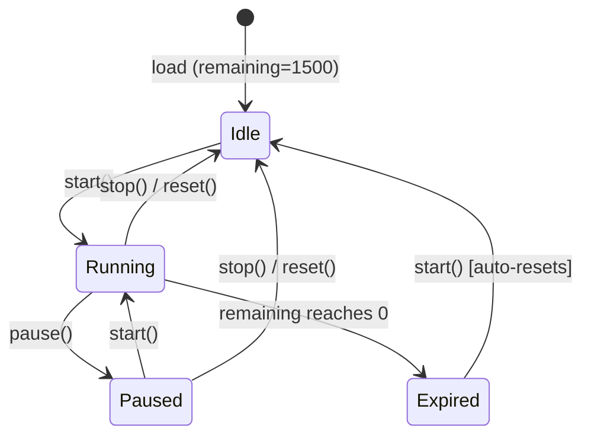

# Design Document: To-Do List Dashboard

## Overview

The To-Do List Dashboard is a self-contained, client-side single-page application (SPA) that runs without any build tooling, server-side rendering, or external dependencies. It delivers four interactive widgets — a live clock/greeting, a Pomodoro focus timer, a full-CRUD task manager, and a quick-links panel — within exactly three files (`index.html`, `css/style.css`, `js/app.js`).

All application state is held in memory as plain JavaScript arrays and persisted exclusively to the browser's `localStorage` API. No network requests are made at any time. The application must function identically whether opened via the `file://` protocol or served by a local HTTP server, and must be compatible with the current versions of Chrome, Firefox, Edge, and Safari.

---

## Architecture

### Architectural Style

The application uses a **module-per-widget IIFE (Immediately Invoked Function Expression)** pattern. Each of the four functional areas is encapsulated in its own IIFE, preventing variable leakage to the global scope while still sharing two thin utility layers (`uid()` and `lsGet`/`lsSet`) defined in the same file before any IIFE executes.

```
index.html
  └─ loads css/style.css
  └─ loads js/app.js
        ├── Constants          (LS_TASKS, LS_LINKS, TIMER_DURATION, DEFAULT_LINKS)
        ├── Utilities          (uid, lsGet, lsSet, pad2)
        ├── IIFE: initClock    (Clock_Widget module)
        ├── IIFE: initTimer    (Focus_Timer module)
        ├── IIFE: initTodoList (Task_Manager module)
        └── IIFE: initQuickLinks (Quick_Links_Panel module)
```

### Data Flow

```
User Interaction
      │
      ▼
DOM Event Listener  (inside owning IIFE)
      │
      ▼
In-Memory Array Mutation
      │
      ├──► lsSet()  ──►  localStorage  (persistence)
      │
      └──► DOM Mutation  (re-render or targeted update)
```

Each IIFE owns its own in-memory array (`tasks` or `links`). The Clock and Timer IIFEs are stateless with respect to localStorage; they use only in-memory variables for `remaining` time and the `setInterval` handle.

### Communication Between Modules

Modules do **not** communicate with each other directly. There is no event bus, shared state object, or module registry. Each IIFE reads from the DOM on initialization (via `document.getElementById`) and writes back to the DOM independently. This matches the no-framework constraint and keeps each widget independently testable.

### Mermaid Architecture Diagram



---

## Components and Interfaces

### 1. Clock Widget (`initClock`)

**Responsibility**: Display a live digital clock, a human-readable date string, and an hour-based greeting that updates every second.

**DOM Bindings**:

| Element ID      | Role                            |
|-----------------|---------------------------------|
| `#greeting`     | Contextual greeting text        |
| `#clock`        | HH:MM:SS display                |
| `#date-display` | Long-form date string           |

**Internal Interface**:

```javascript
getGreeting(hour: number) → string
// Maps hour (0–23) to one of: "Good Morning ☀️", "Good Afternoon 🌤️",
// "Good Evening 🌆", "Good Night 🌙"

tick() → void
// Called once immediately, then every 1000 ms via setInterval.
// Reads new Date(), updates all three DOM elements.
```

**Greeting Boundaries**:

| Hour Range  | Greeting          |
|-------------|-------------------|
| 05:00–11:59 | Good Morning ☀️   |
| 12:00–17:59 | Good Afternoon 🌤️ |
| 18:00–20:59 | Good Evening 🌆   |
| 21:00–04:59 | Good Night 🌙     |

---

### 2. Focus Timer (`initTimer`)

**Responsibility**: Manage a 25-minute countdown timer with Start, Pause, Stop, and Reset controls.

**DOM Bindings**:

| Element ID        | Role                     |
|-------------------|--------------------------|
| `#timer-display`  | MM:SS countdown display  |
| `#btn-start`      | Start button             |
| `#btn-pause`      | Pause button             |
| `#btn-stop`       | Stop button              |
| `#btn-reset`      | Reset button             |

**Internal Interface**:

```javascript
start()  → void  // Begins interval if not already running.
pause()  → void  // Clears interval, preserves remaining time.
stop()   → void  // Clears interval, resets remaining = TIMER_DURATION.
reset()  → void  // Alias for stop().
render() → void  // Updates #timer-display from `remaining`.
setRunningState(isRunning: boolean) → void
// Toggles button disabled states and the .running CSS class on #timer-display.
notifyComplete() → void
// Fires a browser alert (via setTimeout to allow UI to update first).
```

**State Variables** (private to IIFE):

| Variable     | Type    | Description                                   |
|--------------|---------|-----------------------------------------------|
| `remaining`  | number  | Seconds left; initialized to `TIMER_DURATION` |
| `intervalId` | number|null | Return value of `setInterval`, or null  |
| `running`    | boolean | Whether the interval is active                |

---

### 3. Task Manager (`initTodoList`)

**Responsibility**: Provide full CRUD operations on a Task list, with real-time DOM updates and localStorage persistence.

**DOM Bindings**:

| Element ID          | Role                             |
|---------------------|----------------------------------|
| `#task-list`        | `<ul>` containing task items     |
| `#task-input`       | New task text input              |
| `#btn-add-task`     | Add task button                  |
| `#task-error`       | Inline validation error display  |
| `#edit-modal`       | Full-screen modal overlay        |
| `#edit-task-input`  | Edit modal text input            |
| `#edit-error`       | Edit modal validation error      |
| `#btn-save-edit`    | Confirm edit button              |
| `#btn-cancel-edit`  | Discard edit button              |

**Internal Interface**:

```javascript
addTask()      → void  // Validates input, creates Task, appends to list, persists.
toggleTask(id) → void  // Flips completed boolean, persists, updates CSS.
openEditModal(id) → void  // Populates modal with current text, shows modal.
saveEdit()     → void  // Validates edit input, updates task.text, hides modal, persists.
closeEditModal() → void // Hides modal, clears editingId.
deleteTask(id) → void  // Removes from array + DOM, persists.
renderTasks()  → void  // Full re-render of #task-list (used on load only).
createTaskElement(task) → HTMLLIElement  // Creates one task row.
saveTasks()    → void  // Calls lsSet(LS_TASKS, tasks).
showError(el, input, msg) → void
clearError(el, input)     → void
```

**State Variables**:

| Variable    | Type    | Description                             |
|-------------|---------|-----------------------------------------|
| `tasks`     | Task[]  | In-memory task array, loaded from LS    |
| `editingId` | string|null | ID of the task currently in edit modal |

---

### 4. Quick Links Panel (`initQuickLinks`)

**Responsibility**: Display shortcut link buttons, support adding and deleting links, persist to localStorage, and fall back to `DEFAULT_LINKS` on missing/corrupt data.

**DOM Bindings**:

| Element ID            | Role                              |
|----------------------|-----------------------------------|
| `#links-grid`        | Grid container for link buttons   |
| `#link-title-input`  | New link title text input         |
| `#link-url-input`    | New link URL text input           |
| `#btn-add-link`      | Add link button                   |
| `#link-error`        | Inline validation error display   |

**Internal Interface**:

```javascript
addLink()      → void  // Validates title + url, creates Link, appends, persists.
deleteLink(id) → void  // Removes from array + DOM, persists.
renderLinks()  → void  // Full re-render of #links-grid (used on load only).
createLinkElement(link) → HTMLDivElement  // Creates link card with delete button.
saveLinks()    → void  // Calls lsSet(LS_LINKS, links).
showError(msg)  → void
clearErrors()   → void
```

**Fallback Behavior**: If `lsGet(LS_LINKS, null)` returns a non-array (null, corrupt JSON, or missing key), the module immediately initializes `links` from `DEFAULT_LINKS` and writes it back to localStorage.

---

### 5. Utilities

```javascript
uid()                        → string
// Generates a collision-resistant ID:
// Date.now().toString(36) + Math.random().toString(36).slice(2, 7)

lsGet(key: string, fallback: any) → any
// Wraps localStorage.getItem + JSON.parse in try/catch.
// Returns fallback on null, absent key, or parse error.

lsSet(key: string, value: any) → void
// Wraps JSON.stringify + localStorage.setItem in try/catch.
// Silently absorbs QuotaExceededError.

pad2(n: number) → string
// String(n).padStart(2, "0")
```

---

## Data Models

### Task

```typescript
interface Task {
  id:          string;   // uid() — unique per session
  text:        string;   // trimmed, non-empty, max 200 chars
  completed:   boolean;  // false on creation; toggled by user
  createdAt:   string;   // ISO 8601 timestamp (new Date().toISOString())
}
```

**Storage**: Serialized as a JSON array under localStorage key `"tld_tasks"`.  
**Fallback**: Empty array `[]` when key is absent, null, or JSON parsing fails.

**Example**:
```json
[
  {
    "id": "lnj3xk2f",
    "text": "Write design document",
    "completed": false,
    "createdAt": "2025-07-14T09:30:00.000Z"
  }
]
```

---

### Link

```typescript
interface Link {
  id:    string;  // uid() — unique per session
  title: string;  // trimmed, non-empty, max 40 chars
  url:   string;  // trimmed, non-empty, max 500 chars
}
```

**Storage**: Serialized as a JSON array under localStorage key `"tld_links"`.  
**Fallback**: `DEFAULT_LINKS` array when key is absent, null, or JSON parsing fails.

**Default Links preset** (hardcoded fallback):
```json
[
  { "id": "dl-1", "title": "Google",   "url": "https://www.google.com" },
  { "id": "dl-2", "title": "GitHub",   "url": "https://github.com" },
  { "id": "dl-3", "title": "YouTube",  "url": "https://www.youtube.com" },
  { "id": "dl-4", "title": "MDN Docs", "url": "https://developer.mozilla.org" }
]
```

---

### localStorage Key Map

| Key         | Type   | Owner Module   | Fallback       |
|-------------|--------|----------------|----------------|
| `tld_tasks` | Task[] | Task_Manager   | `[]`            |
| `tld_links` | Link[] | Quick_Links_Panel | `DEFAULT_LINKS` |

---

### State Lifecycle Diagrams

#### Task State



#### Timer State



---

## Correctness Properties

*A property is a characteristic or behavior that should hold true across all valid executions of a system — essentially, a formal statement about what the system should do. Properties serve as the bridge between human-readable specifications and machine-verifiable correctness guarantees.*

### Property 1: Greeting correctness for all hours

*For any* integer hour in [0, 23], `getGreeting(hour)` SHALL return exactly one of the four canonical greeting strings, and the returned string SHALL be determined solely by which of the four mutually exclusive hour ranges the hour falls into (05–11 → Morning, 12–17 → Afternoon, 18–20 → Evening, 21–23 and 00–04 → Night), with no hour mapping to two different greetings.

**Validates: Requirements 1.4, 1.5, 1.6, 1.7**

---

### Property 2: Greeting boundary coverage — every hour is covered

*For any* integer hour in [0, 23], `getGreeting(hour)` SHALL return a non-empty string (i.e., the ranges are exhaustive and leave no hour unhandled).

**Validates: Requirements 1.4, 1.5, 1.6, 1.7**

---

### Property 3: Whitespace task rejection

*For any* string composed entirely of whitespace characters (spaces, tabs, newlines), attempting to add it as a task SHALL NOT increase the task list length and SHALL NOT modify `tld_tasks` in localStorage.

**Validates: Requirements 3.5**

---

### Property 4: Task addition round-trip

*For any* non-whitespace-only string `text`, after calling `addTask()` with that text, `lsGet("tld_tasks", [])` SHALL return an array whose last element has a `text` property equal to `text.trim()`, a `completed` property of `false`, and a non-empty `id`.

**Validates: Requirements 3.2, 3.3, 3.4**

---

### Property 5: Toggle completion is an involution

*For any* Task in the in-memory array, calling `toggleTask(id)` twice in succession SHALL leave `task.completed` equal to its original value, and the localStorage representation SHALL reflect the restored state.

**Validates: Requirements 6.2, 6.3, 6.5**

---

### Property 6: Task deletion removes from both memory and storage

*For any* Task present in the in-memory array, calling `deleteTask(id)` SHALL result in an array where no element has that `id`, AND `lsGet("tld_tasks", [])` SHALL also return an array with no element matching that `id`.

**Validates: Requirements 7.2, 7.3, 7.4**

---

### Property 7: localStorage round-trip for tasks preserves all fields

*For any* array of Task objects written via `lsSet("tld_tasks", tasks)`, calling `lsGet("tld_tasks", [])` SHALL return an array of equal length where each element has identical `id`, `text`, `completed`, and `createdAt` values.

**Validates: Requirements 4.1, 11.1**

---

### Property 8: localStorage round-trip for links preserves all fields

*For any* array of Link objects written via `lsSet("tld_links", links)`, calling `lsGet("tld_links", null)` SHALL return an array of equal length where each element has identical `id`, `title`, and `url` values.

**Validates: Requirements 8.1, 9.3**

---

### Property 9: lsGet returns fallback for all non-parseable inputs

*For any* string that is not valid JSON (e.g., random bytes, truncated JSON, empty string), calling `lsGet(key, fallback)` after setting that string in localStorage via `localStorage.setItem(key, invalidString)` SHALL return the `fallback` value without throwing an exception.

**Validates: Requirements 11.1, 11.2, 11.3**

---

### Property 10: lsSet never throws on write failure

*For any* value passed to `lsSet(key, value)`, the function SHALL complete without throwing an exception, even when `localStorage.setItem` is configured to throw (e.g., storage quota simulation).

**Validates: Requirements 11.4**

---

### Property 11: Link addition round-trip

*For any* non-empty `title` and non-empty `url` string, after calling `addLink()` with those values, `lsGet("tld_links", null)` SHALL return an array whose last element has a `title` equal to `title.trim()`, a `url` equal to `url.trim()`, and a non-empty `id`.

**Validates: Requirements 9.2, 9.3**

---

## Error Handling

### localStorage Read Failures

All reads use `lsGet(key, fallback)`:

```javascript
function lsGet(key, fallback) {
  try {
    const raw = localStorage.getItem(key);
    if (raw === null) return fallback;   // key absent
    return JSON.parse(raw);              // may throw SyntaxError
  } catch {
    return fallback;                     // corrupt JSON → fallback
  }
}
```

- `tld_tasks` absent or corrupt → `[]` (empty task list, no error shown to user)
- `tld_links` absent or corrupt → `DEFAULT_LINKS` (preset links shown)
- Returned value that is not an Array → each module re-assigns to fallback (guarded with `Array.isArray()` checks after `lsGet`)

### localStorage Write Failures

All writes use `lsSet(key, value)`:

```javascript
function lsSet(key, value) {
  try {
    localStorage.setItem(key, JSON.stringify(value));
  } catch {
    // QuotaExceededError or SecurityError: silently ignored.
    // In-memory state remains correct; the next successful write will catch up.
  }
}
```

Write failures do not propagate to the UI. The in-memory array remains authoritative for the current session.

### Input Validation

| Module             | Invalid Input                 | Response                                          |
|-------------------|-------------------------------|--------------------------------------------------|
| Task_Manager (add) | empty / whitespace-only text | Shows `#task-error`, adds `.input-error` class, focuses input. No Task created. |
| Task_Manager (edit) | empty / whitespace-only text | Shows `#edit-error`, adds `.input-error` class on modal input. No update saved. |
| Quick_Links_Panel | empty title or empty URL      | Shows `#link-error`, adds `.input-error` on offending fields. No Link created.  |

### Timer Edge Cases

| Scenario | Behavior |
|---|---|
| User clicks Start when `remaining === 0` | `remaining` auto-resets to `TIMER_DURATION` before starting |
| Rapid Start clicks | `if (running) return;` guard prevents duplicate intervals |
| Pause when already paused | `if (!running) return;` guard is a no-op |

### Modal Edge Cases

| Scenario | Behavior |
|---|---|
| Click modal backdrop | `closeEditModal()` called via `e.target === elModal` check |
| Escape key in edit input | `closeEditModal()` called |
| `editingId` not found in `tasks` | `closeEditModal()` called silently |

---

## Testing Strategy

### Dual Testing Approach

Both unit tests (example-based) and property-based tests (PBT) are used. Unit tests verify specific scenarios and integration points; property tests verify universal correctness across the full input space.

### Unit Tests

Unit tests cover:
- **Specific examples**: Adding a task with normal text, toggling a completed task to incomplete, deleting a task by ID, default links loading on first run.
- **Integration points**: DOM elements updated after each mutation, modal open/close cycle, Enter key triggering `addTask`.
- **Edge cases**: Task text of exactly 1 character, task text at 200-character maximum, URL with query string, link title with Unicode.

Suggested framework: **Jest** with **jsdom** (simulates `localStorage` and the browser DOM without a real browser).

### Property-Based Tests

Property tests validate the 11 Correctness Properties defined above. Each test:
- Runs a **minimum of 100 iterations**
- Uses **fast-check** (JavaScript PBT library) to generate arbitrary inputs
- References the design property it validates with a comment tag

**Tag format**: `// Feature: todo-list-dashboard, Property N: <property title>`

#### PBT Applicability

The following modules are suitable for PBT because they contain pure data-transformation logic that is independent of the DOM and browser APIs:

| Module / Function            | Why PBT Applies                                                  |
|-----------------------------|------------------------------------------------------------------|
| `getGreeting(hour)`          | Pure function; input space is finite (0–23) but boundary logic is non-trivial |
| `lsGet` / `lsSet`            | Data serialization round-trips; input space is arbitrary JSON   |
| Task CRUD (addTask, toggleTask, deleteTask) | Pure array transformations; any text string, any boolean state |
| Link CRUD (addLink, deleteLink) | Same as Task CRUD                                                |

The following are **not** suitable for PBT:
- **Timer countdown** — relies on `setInterval` and time; use example-based tests with fake timers.
- **DOM rendering** — verified by snapshot tests or example-based integration tests.
- **localStorage storage quota error** — covered by a single mock-based unit test (Property 10).

#### Example Property Test Sketch

```javascript
// Feature: todo-list-dashboard, Property 5: Toggle completion is an involution
import fc from "fast-check";
import { toggleTask } from "./task-manager";

test("toggleTask twice restores original completed state", () => {
  fc.assert(
    fc.property(
      fc.boolean(),                         // initial completed value
      fc.string({ minLength: 1 }),          // task text
      (initialCompleted, text) => {
        const task = { id: "t1", text, completed: initialCompleted, createdAt: "" };
        const tasks = [task];

        toggleTask(tasks, "t1");
        toggleTask(tasks, "t1");

        expect(tasks[0].completed).toBe(initialCompleted);
      }
    ),
    { numRuns: 100 }
  );
});
```

#### Test Configuration Summary

| Test Type       | Framework       | Iterations | Scope                                |
|----------------|----------------|------------|------------------------------------|
| Unit            | Jest + jsdom   | 1 per case | DOM, timer, specific examples      |
| Property-based | Jest + fast-check | ≥ 100    | Data logic, validation, round-trips |

### Coverage Goals

- All 12 requirements fully covered by at least one test.
- All 11 Correctness Properties covered by dedicated property-based tests.
- 100% branch coverage on `getGreeting`, `lsGet`, `lsSet`, and validation guards.

---

## Interactive Challenges Extension

*This section documents additions made to satisfy interactive challenge requirements without modifying baseline design specs.*

### Extension 1: Theme Manager (`initTheme`) — Light / Dark Mode

**Responsibility**: Toggle between dark and light appearance dynamically via root dataset attribute and persist user preference in localStorage.

**DOM Bindings**:
- Element: `#theme-toggle` (Theme switcher button).

**Behavior & Persistence**:
- Evaluates `localStorage.getItem("tld_theme") || "dark"`.
- Sets `document.documentElement.setAttribute("data-theme", theme)`.
- Updates toggle icon: `🌙` for dark, `☀️` for light.
- Key: `"tld_theme"` (stores `"dark"` or `"light"`).

---

### Extension 2: Custom Name in Greeting

**Responsibility**: Allow the user to customize their greeting name dynamically via prompt and persist it across reloads.

**DOM Bindings**:
- Element: `#user-name` (Display span for name, clickable).
- Element: `#btn-edit-name` (Edit button icon).

**Behavior & Persistence**:
- Reads `localStorage.getItem("tld_username") || "Guest"`.
- Prompts user for a new name upon click; falls back to `"Guest"` if empty or cancelled.
- Updates greeting display text and writes directly to `localStorage.setItem("tld_username", name)`.

---

### Extension 3: Prevent Duplicate Tasks

**Responsibility**: Reject duplicate task descriptions on addition and modification (case-insensitive check).

**Validation Logic**:
- **Addition**: Checks `tasks.some(t => t.text.toLowerCase() === inputText.trim().toLowerCase())`. If true, displays `"This task already exists."` inside `#task-error` and rejects addition.
- **Editing**: Checks `tasks.some(t => t.id !== editingId && t.text.toLowerCase() === editText.trim().toLowerCase())`. If true, displays `"Another task already has this name."` inside `#edit-error` and rejects save.
- Preserves the task unchanged if user keeps the existing text during an edit session.

---

### Extended localStorage Registry

| Key | Type | Owner Module | Fallback | Description |
|---|---|---|---|---|
| `tld_theme` | string | Theme_Manager | `"dark"` | Active UI theme mode (`"dark"` or `"light"`) |
| `tld_username` | string | Clock_Widget | `"Guest"` | User display name for greeting |

---

### Additional Correctness Properties

#### Property 12: Theme Persistence Round-Trip
*For any* valid theme $T \in \{\text{"dark"}, \text{"light"}\}$, toggling to theme $T$ sets `data-theme` attribute on root HTML and guarantees `localStorage.getItem("tld_theme") === T`.

#### Property 13: Case-Insensitive Duplicate Task Rejection
*For any* task with description $D$ in `tasks`, submitting $D'$ where $D'.\text{trim}().\text{toLowerCase}() = D.\text{toLowerCase}()$ SHALL NOT increase `tasks.length` and SHALL display a duplicate error message.

#### Property 14: Custom Name Fallback Invariant
*For any* input containing only whitespace or null when editing user name, the stored `tld_username` and displayed name SHALL default to `"Guest"`.
